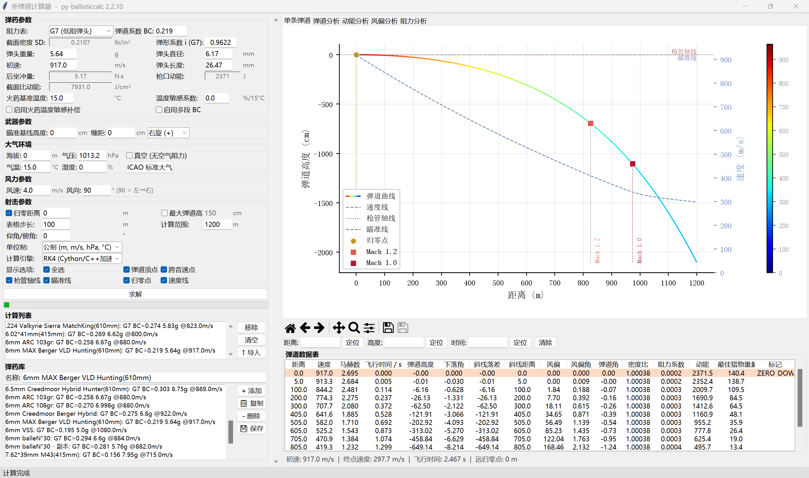
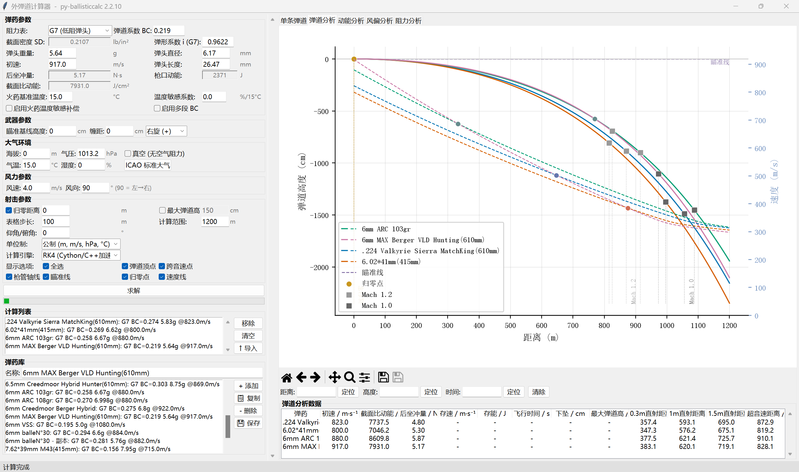
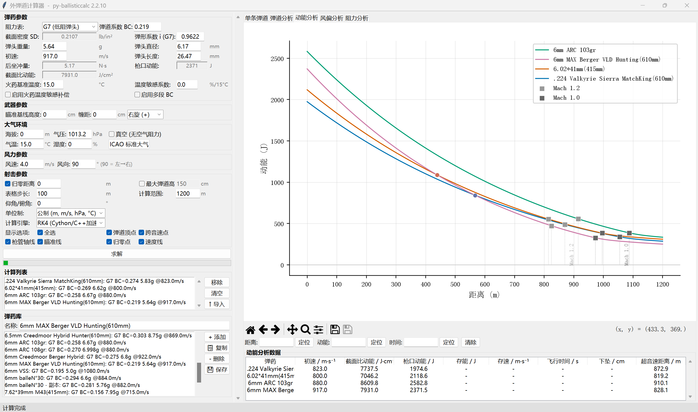
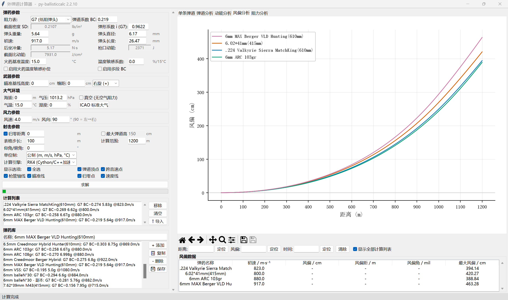
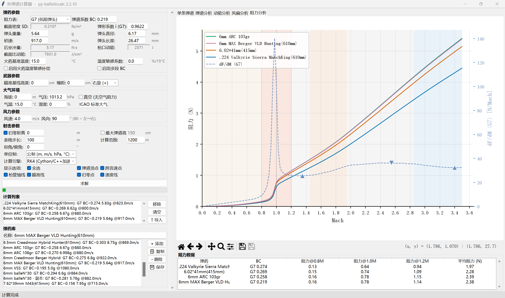

# 外弹道计算器

基于 [py-ballisticcalc 2.2.10](https://github.com/o-murphy/py-ballisticcalc) 的桌面外弹道计算应用。Tkinter 原生界面 + Matplotlib 学术风格交互图表，面向精确射击与弹药对比场景。

> 🇬🇧 **English readers:** scroll down for the [English version](#english).

## 功能概览

### 5 个分析 Tab

| Tab | 名称 | 图表 | 数据表 |
|-----|------|------|--------|
| 1 | 单条弹道 | CFD 彩虹渐变色轨迹图 + 速度副轴 | 16 列详细表（分桶行颜色：归零-橙/顶点-绿/跨音速-蓝） |
| 2 | 弹道分析 | 多弹药叠加轨迹图 + 速度副轴 + 曲线交点 | 13 列对比表（含截面比动能、后坐冲量、PBR 0.3/1.0/1.5m、超音速距离） |
| 3 | 动能分析 | 多弹药动能曲线 + 3 个 Mach 点 + 曲线交点 | 9 列分析表（截面比动能支持距离插值） |
| 4 | 风偏分析 | 多弹药风偏曲线 | 对比表 6 列 / 详细表 5 列（复选框切换） |
| 5 | 阻力分析 | 多弹药阻力(Mach)曲线 + dF/dM 导数副轴 + G7 极值点 + 曲线交点 | 6 列数据表（BC 自适应带阻力表类型前缀） |

### 界面截图

| Tab 1: 单条弹道 | Tab 2: 弹道分析 | Tab 3: 动能分析 | Tab 4: 风偏分析 | Tab 5: 阻力分析 |
|---|---|---|---|---|
|  |  |  |  |  |

### 弹药库

- JSON 持久化，多弹药批量计算
- 双向同步：弹药库 ↔ 计算列表点击联动
- 添加 / 复制 / 删除 / 保存 / 导入 / 移除 / 清空
- 列表行显示阻力表类型 + BC + 弹重 + 初速

### 实时参数

- **枪口动能** / **后坐冲量** / **截面比动能** (J/cm²) / **截面密度** (SD, lb/in²) 实时计算
- BC ↔ i（弹形系数）双向联动编辑
- 截面比动能在 Tab 2/3 表格中支持距离插值

### 图表交互

- 5 个 Tab 全部 blit 加速 hover，60ms 防抖重绘
- hover 十字光标 + 数值提示，click 高亮吸附特殊点
- 多曲线交点自动检测，混合色标记（不进入图例）
- 中文化 Matplotlib 工具栏（含图表复制到剪贴板）
- Tab 1 显示选项：全选联动、弹道顶点/跨音速点/归零点/枪管轴线/瞄准线/速度线独立开关

### 高级弹道功能

- **弹道顶点锁定**：给定最大弹道高，二分搜索反求归零距离
- **PBR 直射距离**：3 级目标高度 (0.3 / 1.0 / 1.5 m)
- **超音速距离**：找到 Mach 降至 1.2 的距离
- **真空模式**：无空气阻力模拟
- **ICAO 标准大气**：海拔联动温度/气压，一键复位
- **自定义阻力表**：任意 Mach-CD 数据点输入
- **仰角/俯角**：非水平射击支持
- **缠距 + 旋向**：左旋/右旋选择

### 表格通用功能

- **右键隐藏列**：所有 7 个 Treeview 通用，原生 checkbutton 菜单
- **自适应列宽**：根据表头+首行+末行自动调整

### 单位系统

3 种单位制 — 公制 / 英制 / 混合制，16 个 PreferredUnits 槽位全覆盖，UI 标签随单位切换。

## 源代码库利用率

### 已充分利用 ✓

| 类别 | 库功能 | 使用情况 |
|------|--------|---------|
| 阻力模型 | 9 张阻力表 + 自定义 Mach-CD | 全部暴露在 UI 下拉框 |
| 多段 BC | `DragModelMultiBC` + `BCPoint` | 完整 UI（动态增删行） |
| 积分引擎 | Euler / RK4 / SciPy(odeint) / Velocity Verlet | 全部 6 种暴露在下拉框 |
| Cython 加速 | `CythonizedRK4IntegrationEngine` / `CythonizedEulerIntegrationEngine` | **RK4 C++ 版设为默认引擎** |
| 弹药 | `Ammo` (mv, powder_temp, temp_modifier, use_powder_sensitivity) | 完整接线 |
| 武器 | `Weapon` (sight_height, twist) | 完整接线，含旋向选择 |
| 大气 | `Atmo`, `Vacuum`, ICAO 标准大气 | 完整接线，海拔联动 |
| 风 | `Wind` | 单层风（多层风区低频未加） |
| 射击 | `Shot` (look_angle) | 仰角/俯角输入，支持非水平射击 |
| 计算 | `Calculator` (set_weapon_zero, barrel_elevation_for_target, fire) | 完整使用 |
| 结果 | 全部 16 个 `TrajectoryData` 字段 | 全部展示于数据表 |
| 插值 | `HitResult.get_at()` | 5 个 Tab 都大量使用 |
| 单位 | `PreferredUnits` 全部 16 个槽位 | 公制/英制/混合 3 种单位制动态切换 |

### 库有但经分析不采纳 ✗

#### 物理效应

| 库功能 | 不采纳原因 |
|--------|-----------|
| 科里奥利力 | 需经纬度/射击方位输入，对 >800m 远程有 ~10-30cm 影响，留待后续 |
| 多层风区 | 多段风距场景低频，UI 复杂度不划算 |
| 枪械倾斜 (`cant_angle`) | 边缘场景 |
| 归零大气分离 | 边缘场景（海平面归零→高山射击） |

#### 计算引擎高级功能

| 库功能 | 不采纳原因 |
|--------|-----------|
| 高抛弹道 `find_zero_angle(lofted=True)` | 迫击炮/榴弹炮场景，非轻武器 |
| 最大射程 `find_max_range()` | 非实用场景 |
| 引擎参数微调 `BaseEngineConfig` | 默认参数覆盖 99.9% 情况，暴露给用户徒增困惑 |
| 时间步记录 `fire(time_step=N)` | 近垂直弹道才需要 |
| 密集输出 `fire(dense_output=True)` | 当前 PCHIP 插值精度已足够 |
| SciPy 方法切换 DOP853/BDF/LSODA | RK4 对弹道问题已充足，边际提升 |

#### 库内置便利方法

| 库方法 | 不采纳原因 |
|--------|-----------|
| `HitResult.danger_space()` | 与自写 PBR 语义不同（给定距离求危险区 vs 给定弹道高求直射距离），不可替代 |
| `TrajectoryData.formatted()` / `.in_def_units()` | 返回无名字段 tuple，魔法索引反降可读性 |
| `Sight` 瞄具系统 | 曾完整接线但无输出端，已精简，仅保留 `sight_height` |
| `Ammo.calc_powder_sens(v1, t1)` | 大多数用户无两组温度/初速数据，需求低频 |
| `BaseIntegrationEngine.find_apex()` | 库已在积分中自动标记 APEX flag，无需额外搜索 |

#### 可视化与工具

| 库功能 | 不采纳原因 |
|--------|-----------|
| `hit_result_as_plot()` | 自建 Figure 无法注入 TkAgg；远不如自绘（CFD 彩虹渐变、中文标签、blit 交互） |
| `hit_result_as_dataframe()` | 目标输出是 `ttk.Treeview`（含分桶合并、行颜色标记、中文表头），非 DataFrame |
| `enable_file_logging()` | App 无日志系统，弹窗 + 状态栏即足够 |

## 安装与运行

```bash
pip install py-ballisticcalc==2.2.10 py-ballisticcalc-exts==2.2.10
python main.py
```

最低 Python 3.10。`py-ballisticcalc-exts` 可选，缺少时自动回退到 Python 版引擎。

---

## English

# ExteriorBallisticsCalc

A desktop exterior ballistics calculator powered by [py-ballisticcalc 2.2.10](https://github.com/o-murphy/py-ballisticcalc). Features a native Tkinter interface and publication-quality interactive [Matplotlib](https://matplotlib.org/) charts — built for precision shooting and ammunition comparison scenarios.

> **Note:** The UI is currently Chinese-only. English localization may come in a future release.

## Features

### 5 Analysis Tabs

| Tab | Name | Chart | Data Table |
|-----|------|-------|------------|
| 1 | Single Trajectory | CFD rainbow-gradient trajectory + velocity secondary axis | 16-column detail table (color-coded: zero-orange / apex-green / transonic-blue) |
| 2 | Trajectory Analysis | Multi-ammo overlay trajectory + velocity secondary axis + curve intersections | 13-column comparison table (sectional kinetic energy, recoil impulse, PBR 0.3/1.0/1.5 m, supersonic range) |
| 3 | Energy Analysis | Multi-ammo kinetic energy curves + 3 Mach markers + curve intersections | 9-column analysis table (sectional kinetic energy with distance interpolation) |
| 4 | Wind Drift | Multi-ammo wind drift curves | Comparison 6 columns / Detail 5 columns (checkbox toggle) |
| 5 | Drag Analysis | Multi-ammo drag (Mach) curves + dF/dM derivative secondary axis + G7 extrema + curve intersections | 6-column data table (BC prefixed with drag table type) |

### Screenshots

| Tab 1: Single | Tab 2: Analysis | Tab 3: Energy | Tab 4: Wind | Tab 5: Drag |
|---|---|---|---|---|
|  |  |  |  |  |

### Ammo Library

- JSON persistence, multi-ammo batch calculation
- Bidirectional sync: library ↔ calculation list click linkage
- Add / Duplicate / Delete / Save / Import / Remove / Clear
- List rows show drag table type + BC + bullet weight + muzzle velocity

### Real-time Parameters

- **Muzzle energy** / **Recoil impulse** / **Sectional kinetic energy** (J/cm²) / **Sectional density** (SD, lb/in²) live calculation
- BC ↔ i (form factor) bidirectional linked editing
- Sectional kinetic energy supports distance interpolation in Tabs 2/3

### Chart Interaction

- Blit-accelerated hover across all 5 tabs, 60 ms debounce redraw
- Hover crosshair + tooltip, click to highlight and snap to key points
- Auto-detection of multi-curve intersections, blend-color markers (excluded from legend)
- Localized Matplotlib toolbar (including chart copy to clipboard)
- Tab 1 display options: select-all linking, independent toggles for apex/transonic/zero/bore-line/sight-line/velocity-line

### Advanced Ballistics

- **Apex lock**: given max ordinate, binary-search reverse solve for zero distance
- **PBR**: 3 target heights (0.3 / 1.0 / 1.5 m)
- **Supersonic range**: find distance where Mach drops to 1.2
- **Vacuum mode**: no-drag simulation
- **ICAO standard atmosphere**: altitude-linked temperature/pressure, one-click reset
- **Custom drag table**: arbitrary Mach-CD data point input
- **Look angle**: uphill/downhill shooting support
- **Twist rate + direction**: left/right-hand twist selection

### Universal Table Features

- **Right-click hide columns**: all 7 Treeviews, native checkbutton menu
- **Adaptive column width**: auto-fit based on header + first row + last row

### Unit System

3 unit systems — Metric / Imperial / Mixed, covering all 16 PreferredUnits slots. UI labels switch with unit selection.

## Library Utilization

### Fully Leveraged ✓

| Category | Library Feature | Usage |
|----------|----------------|-------|
| Drag Models | 9 drag tables + custom Mach-CD | All exposed in UI dropdown |
| Multi-BC | `DragModelMultiBC` + `BCPoint` | Full UI (dynamic row add/remove) |
| Integration Engines | Euler / RK4 / SciPy(odeint) / Velocity Verlet | All 6 exposed in dropdown |
| Cython | `CythonizedRK4IntegrationEngine` / `CythonizedEulerIntegrationEngine` | **RK4 C++ variant set as default** |
| Ammo | `Ammo` (mv, powder_temp, temp_modifier, use_powder_sensitivity) | Fully wired |
| Weapon | `Weapon` (sight_height, twist) | Fully wired, with twist direction |
| Atmosphere | `Atmo`, `Vacuum`, ICAO standard atmosphere | Fully wired, altitude-linked |
| Wind | `Wind` | Single-layer wind |
| Shot | `Shot` (look_angle) | Look angle input for non-level shooting |
| Calculator | `Calculator` (set_weapon_zero, barrel_elevation_for_target, fire) | Fully used |
| Results | All 16 `TrajectoryData` fields | All displayed in data tables |
| Interpolation | `HitResult.get_at()` | Heavily used across all 5 tabs |
| Units | All 16 `PreferredUnits` slots | 3 unit systems with dynamic switching |

### Intentionally Excluded ✗

#### Physical Effects

| Library Feature | Reason for Exclusion |
|-----------------|---------------------|
| Coriolis force | Requires lat/lon/azimuth input; ~10–30 cm effect beyond 800 m; deferred |
| Multi-layer wind zones | Rare use case, UI complexity not justified |
| Cant angle | Niche scenario |
| Zero-atmosphere separation | Niche scenario (sea-level zero → mountain shooting) |

#### Engine Advanced Features

| Library Feature | Reason for Exclusion |
|-----------------|---------------------|
| Lofted trajectory `find_zero_angle(lofted=True)` | Mortar/howitzer domain, not small arms |
| Max range `find_max_range()` | Not practically useful |
| Engine config tuning `BaseEngineConfig` | Defaults cover 99.9% of cases; exposing to users adds confusion |
| Timestep recording `fire(time_step=N)` | Only needed for near-vertical trajectories |
| Dense output `fire(dense_output=True)` | PCHIP interpolation accuracy is sufficient |
| SciPy method switch DOP853/BDF/LSODA | RK4 is adequate for ballistic problems |

#### Built-in Convenience Methods

| Library Method | Reason for Exclusion |
|----------------|---------------------|
| `HitResult.danger_space()` | Different semantics from custom PBR implementation |
| `TrajectoryData.formatted()` / `.in_def_units()` | Returns unnamed tuple; magic indices reduce readability |
| `Sight` system | Was fully wired but had no output sink; trimmed to `sight_height` only |
| `Ammo.calc_powder_sens(v1, t1)` | Most users lack dual temperature/velocity data |
| `BaseIntegrationEngine.find_apex()` | Library already tags APEX during integration |

#### Visualization & Utilities

| Library Feature | Reason for Exclusion |
|-----------------|---------------------|
| `hit_result_as_plot()` | Cannot inject into TkAgg; custom rendering is superior (CFD rainbow, Chinese labels, blit interaction) |
| `hit_result_as_dataframe()` | Target output is `ttk.Treeview` (bucket-colored rows, Chinese headers), not DataFrame |
| `enable_file_logging()` | App has no logging system; dialogs + status bar suffice |

## Install & Run

```bash
pip install py-ballisticcalc==2.2.10 py-ballisticcalc-exts==2.2.10
python main.py
```

Requires Python 3.10+. `py-ballisticcalc-exts` is optional; missing it falls back to pure-Python engines.
